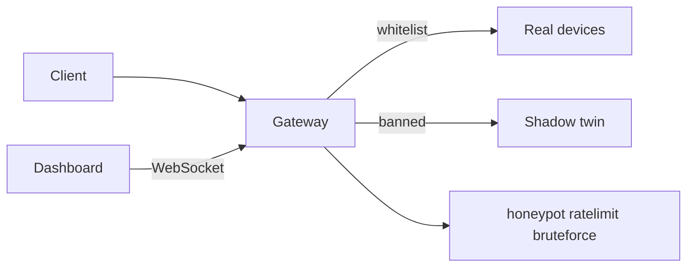

# IoT Deception Gateway

FastAPI gateway for a smart-home lab: one HTTP API routes clients to either **real IoT state** (`REAL_DEVICES`) or a **shadow digital twin** after threat detection. A web **dashboard** shows topology, traffic logs, and a Home Assistant–style phone mock. Sandboxed clients can **re-authenticate** via **in-band IoT port knocking** (light → lock → light) without leaving the mobile app flow.

## Features

- **Dual data plane** — legitimate sessions see real device firmware and state; banned clients see mirrored shadow devices with jitter and legacy builds
- **Traffic analysis** — honeypot paths, per-IP rate limiting, brute-force login tracking (`honeypot`, `ratelimit`, `bruteforce`)
- **Client fingerprint** — ban/whitelist uses `IP + X-Gateway-Client-Id` (NAT-safe; dashboard and curl can coexist on one IP)
- **Shadow canary** — extra light entity only visible in the shadow `/api/states` payload
- **Static decoys** — sandbox-only exploit-shaped URLs return plausible errors ([`server/shadow_world/decoys.py`](server/shadow_world/decoys.py))
- **Masked errors** — probes and API failures avoid leaking FastAPI stack traces in responses
- **Live dashboard** — vis-network topology, WebSocket log stream, Red Team panel, port-knock progress UI

## Architecture



The browser dashboard generates a persistent client id (`localStorage`) and sends it on REST and on `/ws/dashboard?client_id=`. Server-side session routing keys combine client IP with that header ([`server/decision_logic/client_identity.py`](server/decision_logic/client_identity.py)).

Home Assistant in Docker is an optional **segmented** service on `deception_net`; the gateway API uses in-memory `REAL_DEVICES`, not HA REST, for the deception demo.

## Requirements

- **Python 3.11+** and `pip` for local runs
- **Docker Engine** with Compose plugin (`docker compose`) for the lab stack (optional)

## Quick start

### Local development

```bash
pip install -r server/requirements.txt
cd server
python main.py
```

Open the dashboard at `http://127.0.0.1:8000/` (static files under `/static/`). The phone mock calls the same API (`/api/states`, lights, locks) as external clients.

### Docker

From the repository root:

```bash
docker compose up -d --build
```

- Gateway (dashboard + API): `http://127.0.0.1:8000/`
- Home Assistant: reachable only inside `deception_net` by default (`http://homeassistant:8123` from the gateway container)

See [Docker lab](#docker-lab) for segmentation checks, optional HA on port 8123, and VirtualBox access from a host machine.

## Configuration

| Variable | Default | Purpose |
|----------|---------|---------|
| `ENABLE_DOCS` | off | Enable OpenAPI UI at `/docs` |
| `ENABLE_DETECTOR_SIM` | off | Allow `POST /api/dev/simulate-detection/{detector_id}` |
| `ENABLE_WS_DEMO_LOGS` | `0` | Periodic demo log lines on the dashboard WebSocket |

Example (Linux/macOS): `ENABLE_DOCS=1 python main.py` from `server/`. Windows: `set ENABLE_DOCS=1` before starting.

## Demo at a glance

1. Open the dashboard and confirm topology + live log.
2. `GET /api/lights/living` as a clean client → `REAL_API`.
3. Trigger honeypot (e.g. `GET /.env`) for a test client id → shadow responses and canary in `/api/states`.
4. Complete port knock: living ON → unlock `main_door` → living OFF (same `X-Gateway-Client-Id`) → back to `REAL_API`.
5. Optional: `ENABLE_DETECTOR_SIM=1` and simulate a detector hit from the dashboard session.

Full step-by-step commands, WebSocket event types, and decoy examples: **[docs/TESTING.md](docs/TESTING.md)**.

## Docker lab

Typical deployment: **Kali Linux** in VirtualBox. Only the **gateway** publishes port **8000** by default; Home Assistant stays on the internal bridge.

**Prerequisites:** Docker Compose, user in `docker` group, ~2 CPU / 4 GB RAM (first HA start may take several minutes).

**Segmentation check:**

```bash
curl -s -o /dev/null -w "%{http_code}\n" http://127.0.0.1:8000/
curl -s -o /dev/null -w "%{http_code}\n" http://127.0.0.1:8123 || true
docker compose exec gateway curl -s -o /dev/null -w "%{http_code}\n" http://homeassistant:8123
```

**Expose HA on the VM host** (report / compare with real HA):  
`docker compose -f docker-compose.yml -f docker-compose.ha-host.yml up -d` → `http://127.0.0.1:8123`, data in `./ha_config` (gitignored).  
Return to segmented mode: `docker compose -f docker-compose.yml up -d` (no 8123 mapping).

| VirtualBox adapter | Use case |
|--------------------|----------|
| NAT | Browser on the VM → `http://127.0.0.1:8000` |
| Bridged or NAT port forward | Host machine → `http://<VM-IP>:8000` |

| File | Role |
|------|------|
| `Dockerfile` | Gateway image (`server/` + `frontend/`) |
| `docker-compose.yml` | `gateway` + `homeassistant`, network `deception_net` |
| `docker-compose.ha-host.yml` | Optional `8123:8123` for HA |
| `ha_config/` | HA persistent config volume |

## Project layout

```
frontend/          Dashboard HTML, CSS, JS (vis-network graph, HA mock, Red Team UI)
server/
  main.py          FastAPI app entrypoint
  api/             REST: lights, locks, states, topology, auth
  decision_logic/  Ban/whitelist, port-knock FSM
  detection_module/ Analyzers and detectors
  shadow_world/    Real mirror, shadow twin, decoys, jitter
  ws/              Dashboard WebSocket
  schemas/         HA-style JSON builders
docs/
  TESTING.md       Manual verification checklist
```

## Documentation

- **[docs/TESTING.md](docs/TESTING.md)** — verification checklist, WebSocket events, detector simulation, decoys
